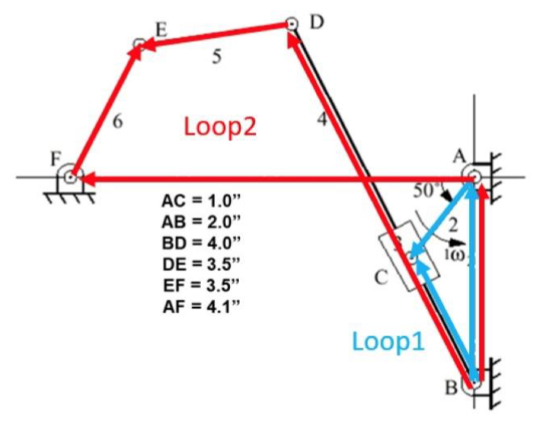

# Linkage Analysis

A linkage analysis project with kinematics and animation.

This project utilizes sympy, which is not the best idea for numerical calculations. Symbolic calculation could be seen as an alternative solution to some numerical problems, but when the solution does not have a close form, only numerical calculations will work.

## Files

### kinematic analysis.py

Input favorable dimensions of the linkage, and the program will output the kinematic data of the linkage. Please see linkage analysis.pdf for more details.

### animation.py

Input favorable dimensions of the linkage, and the program will output the animation of the linkage. Please see linkage analysis.pdf for more details.

### utils.py

This file contains some useful functions for the project. Both other two Python files import this file.

## Variable Naming

### letter

link: r
angle: t
velocity: v
angular velocity: w
acceleration: a

### number

For numbering the links. See .pdf for reference.

### normal or symbolic
Normal variables with values are named with a "v" in the middle, e.g. rv1, rv2, which is different from symbolic ones.
